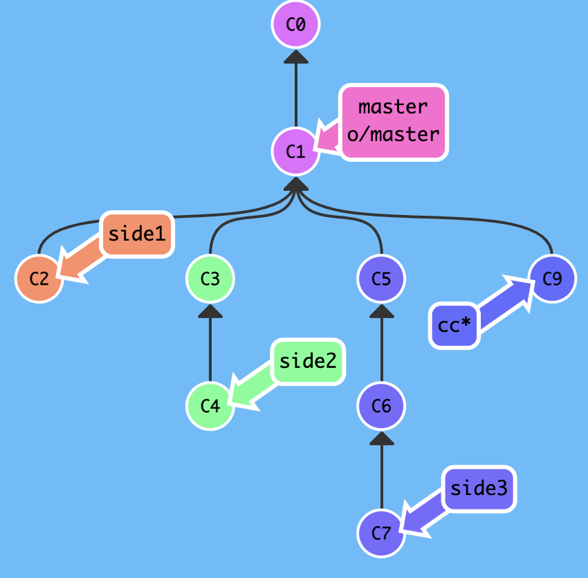
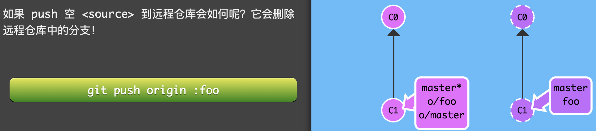

# Intro

## git 基础

### git 简介

1. Git 仓库中的提交记录保存的是我的目录下所有文件的快照，就像是把整个目录复制，然后再粘贴一样
2. Git 希望提交记录尽可能地轻量，条件允许的情况下，它会将当前版本与仓库中的上一个版本进行对比，并把所有的差异打包到一起作为一个提交记录。
3. Git 还保存了提交的历史记录。这也是为什么大多数提交记录的上面都有父节点的原因
4. 把提交记录看作是项目的快照。提交记录非常轻量，可以快速地在这些提交记录之间切换

#### git branch

1. 早建分支！多用分支！
2. 创建再多分的支也不会造成储存或内存上的开销
3. 按逻辑分解任务，到不同的分支
4. 使用分支，基于这个分支的提交以及它所有的父提交，进行新的工作。
5. 创建一个新的分支 test，同时切换到新创建的分支 test
   1. git checkout -b <your_branch_name>
6. 或者
   1. git branch <your_branch_name>
      1. 比如 master 指向 c1，git branch test 后，test 也指向 c1
   2. git checkout <your_branch_name>
      1. 切换到 test 分支上

#### git merge

1. 两个分支合并到一起。or 新建一个分支，在其上开发某个新功能，开发完成后再合并回主线。
2. 在 Git 中合并两个分支时会产生一个特殊的提交记录，它有两个父节点。
   1. 即 我要把这两个父节点本身及它们所有的祖先都包含进来。
3. 比如
   1. c1 有两个节点 c2 和 c3，c2 上进行了 bugFix，master 指向 c3
   2. 注意 c2 从 c1 分出来一个结点，要 commit 一次,否则 c1 和 c2 共用一个结点
      
   3. git merge bugFix 后，
   4. 即将 bugFix 到 master 上
   5. 产生了一个 c4，master 指向 c4
   6. 从 master 开始沿着箭头向上看，在到达起点的路上会经过所有的提交记录，
   7. 也就是从 c4 往上看有 c2 和 c3
   8. 这个 c4 就是一个特殊的提交记录，意味着 master 包含了对代码库的所有修改
   9. 继续 master 继承自 bugFix，所以把 master 分支合并到 bugFix，只需把 bugFix 移动到 master 所指向的提交记录。
      

#### git rebase

1. 也是用于合并分支
2. Rebase 实际上就是取出一系列的提交记录，“复制”它们，然后在另外一个地方逐个的放下去。
3. Rebase 的优势就是可以创造更线性的提交历史
4. 只允许使用 Rebase 的话，代码库的提交历史将会变得异常清晰
5. 比如
   1. git rebase master 后，
   2. 即将 bugFix 到 master 上
   3. 看上去是按顺序，bugfix 的节点在 master 下面，但其实是并行开发
      
   4. 现在到 master 分支上的 bugFix 的结点是原来的副本
      
   5. 在切换到 master 后，git rebase bugFix 后。或者不切换到 master 上，直接 git rebase bugFix master。
   6. 将落后的 master 指针，指向了 bugFix 所指向的
      

#### 合并远程仓库 merge 和 rebase

1. Rebase
   1. 优点
      1. Rebase 使你的提交树变得很干净, 所有的提交都在一条线上
   2. 缺点
      1. Rebase 修改了提交树的历史
      2. 比如, 提交 C1 可以被 rebase 到 C3 之后。这看起来 C1 中的工作是在 C3 之后进行的，但实际上是在 C3 之前
2. merge
   1. 优点
      1. 保留提交历史

## git 高级

### git 提交树上移动

### HEAD

1. HEAD 是一个对当前检出记录的符号引用
2. HEAD 指向你正在其基础上进行工作的提交记录
3. HEAD 总是指向当前分支上最近一次提交记录
4. 大多数修改提交树的 Git 命令都是从改变 HEAD 的指向开始的
5. HEAD 通常情况下是指向分支名的（如 bugFix）。在你提交时，改变了 bugFix 的状态，这一变化通过 HEAD 变得可见
6. 比如
   1. git checkout c1 后，head 指向了 c1,注意是 head 指向,因为这里 checkout 的 c1，c1 可以看作记录的哈希值。当 checkout master 时候，才是到分支上，head 也指向这个 master 分支。注意 checkout 不可以是 head。
      
   2. git checkout master，回到了 master 上
   3. git commit master，多出了个 c2 的结点
   4. git checkout c2 后，head 指向了 c2
      
7. 看 HEAD 指向
   1. cat .git/HEAD
   2. 若 HEAD 指向的是一个引用，则 git symbolic-ref HEAD 查看它的指向
8. 分离的 HEAD
   1. 分离的 HEAD 就是让其指向了某个具体的提交记录而不是分支名
9. 比如
   1. HEAD 指向 master， master 指向 C1
      
   2. git checkout c1, head 指向了 C1
      

### 相对引用（^）

1. 使用相对引用最多的就是移动分支
2. 没有相对引用之前
   1. 通过指定提交记录哈希值的方式(git commit)在 Git 中移动不太方便，只能用 git log 来查查看提交记录的哈希值。
   2. 且哈希值在真实的 Git 世界中也会更长，如提交记录的哈希值可能是 fed2da64c0efc52936
   3. Git 对哈希的处理很智能。你只需要提供能够唯一标识提交记录的前几个字符即可。可以仅输入 fed2 而不是上面的一长串字符。
3. Git 引入了相对引用后
   1. 可以从一个易于记忆的地方（比如 bugFix 分支或 HEAD）开始计算
   2. 使用 ^ 向上移动 1 个提交记录
   3. 使用 ~ < num > 向上移动多个提交记录，如 ~3
4. 比如
   1. 下图
      
   2. git checkout master^ 后
      
5. 比如
   1. 下图
      
   2. 经历操作
      
6. 比如
   1. 下图
      
   2. git checkout HEAD~4 后
      

### 强制修改分支位置

1. 以直接使用 -f 选项让分支指向另一个提交
2. 比如
   1. 下图
      
   2. git branch -f master HEAD~3
   3. 上面的命令会将 master 分支强制指向 HEAD 的第 3 级父提交。
      
   4. 也可以 git branch -f master HEAD~0
   5. 也可以 git branch -f master c6
   6. 但是没有 git branch -f head c6
   7. 只有 git checkout HEAD

### 强撤销变更

1. 和提交一样，撤销变更由底层部分（暂存区的独立文件或者片段）和上层部分（变更到底是通过哪种方式被撤销的）组成
2. 主要有两种方法用来撤销变更, 是 git reset 和 git revert
3. Git Reset

   1. 通过把分支记录回退几个提交记录来实现撤销改动
   2. 可以将这想象成“改写历史”
   3. git reset 向上移动分支，原来指向的提交记录就跟从来没有提交过一样
   4. 下图
      
   5. git reset HEAD~1 后
      

4. Git Revert
   1. 本地分支中使用 git reset 很方便，但是这种“改写历史”的方法对大家一起使用的远程分支是无效的
   2. 为了撤销更改并分享给别人，需要使用 git revert
   3. 下图
      
   4. 此时 head 和 master 同时指向 C2
   5. git revert HEAD 后
      
   6. 此时 C2' 的状态与 C1 是相同的

## 移动提交记录之自由修改提交树

### git cherry-pick

1. “我想要把这个提交放到这里, 那个提交放到刚才那个提交的后面”
2. git cherry-pick
   1. git cherry-pick <提交号>...
   2. 将一些提交复制到当前所在的位置（HEAD）下面的话， Cherry-pick 是最直接的方式
3. 比如
   1. 下图
      
   2. git cherry-pick c2 c4 后
   3. 把 c2 和 c4 的节点都放在了当前指向的分支下面
      

### 交互式的 rebase

1. 交互式的 rebase
   1. 当你知道你所需要的提交记录（并且还知道这些提交记录的哈希值）时, 用 cherry-pick 很好
   2. 如果不清楚你想要的提交记录的哈希值，利用交互式的 rebase，从一系列的提交记录中找到想要的记录
   3. 交互式 rebase 指的是使用带参数 --interactive 的 rebase 命令, 简写为 -i
   4. 如果你在命令后增加了这个选项, Git 会打开一个 UI 界面并列出将要被复制到目标分支的备选提交记录，它还会显示每个提交记录的哈希值和提交说明，提交说明有助于你理解这个提交进行了哪些更改。
   5. 在实际使用时，所谓的 UI 窗口一般会在文本编辑器 —— 如 Vim —— 中打开一个文件
   6. 当 rebase UI 界面打开时, 你能做 3 件事:
      1. 调整提交记录的顺序（通过鼠标拖放来完成）
      2. 删除你不想要的提交（通过切换 pick 的状态来完成，关闭就意味着你不想要这个提交记录）
      3. 合并提交。允许你把多个提交记录合并成一个
2. 比如
   1. 下图
      
   2. git rebase -i head ～ 4 后
      
      这里的 c2 c3 c4 c5 可以自行换位置
   3. head ～ 4，向上 4 个，定位到 c1,也就是复制到 c1 后面
      

## 杂项

### 只取一个提交记录

1. 本地栈式提交
   1. 来看一个在开发中经常会遇到的情况：我正在解决某个特别棘手的 Bug，为了便于调试而在代码中添加了一些调试命令并向控制台打印了一些信息。
   2. 这些调试和打印语句都在它们各自的提交记录里。最后我终于找到了造成这个 Bug 的根本原因，解决掉以后觉得沾沾自喜！
   3. 最后就差把 bugFix 分支里的工作合并回 master 分支了。你可以选择通过 fast-forward 快速合并到 master 分支上，但这样的话 master 分支就会包含我这些调试语句了。你肯定不想这样
   4. 实际我们只要让 Git 复制解决问题的那一个提交记录就可以了
   5. 使用 git rebase -i 和 git cherry-pick 来达到目的

### 提交的技巧 git rebase -i

1. 接下来这种情况也是很常见的：你之前在 newImage 分支上进行了一次提交，然后又基于它创建了 caption 分支，然后又提交了一次。
2. 此时你想对的某个以前的提交记录进行一些小小的调整。比如设计师想修改一下 newImage 中图片的分辨率，尽管那个提交记录并不是最新的了。
3. 下面使用 git rebase -i 的方法
   1. 先用 git rebase -i 将提交重新排序，然后把我们想要修改的提交记录挪到最前
   2. 然后用 commit --amend 来进行一些小修改
   3. 接着再用 git rebase -i 来将他们调回原来的顺序
   4. 最后我们把 master 移到修改的最前端（用你自己喜欢的方法），就大功告成啦！
   5. 当然完成这个任务的方法不止上面提到的一种（我知道你在看 cherry-pick 啦
4. 比如
   1. 下图
      
   2. git rebase -i HEAD~2 重新排序，然后把 c3 交记录挪到最前
   3. git commit --amend 做一些修改，把 c2 的图片再更新一下
   4. git rebase -i HEAD~2 重新排序，使得提交顺序还是先提交图片的 c2，再提交 caption 的 c3，但这时 c2 的图片已经被更新
   5. git rebase caption master，把 master 移到修改的最前端

### 提交的技巧 git cherry-pick

1. 比如
   1. 下图
      
   2. git cherry-pick c2
      
2. 比如
   1. 下图
      
   2. git checkout master
   3. git cherry-pick C2
   4. git commit --amend 重新提交是在日志看不到操作记录的
   5. git cherry-pick c3
3. git commit -m 提交之后，发现-m 的说明文字写的有问题，想要重新写一次，也就是想撤销上次的提交动作，重新提交一次。
   这个时候可以用命令 git commit --amend

### git tags

1. 可以永远指向某个提交记录的标识,永久地将某个特定的提交命名为里程碑，然后就可以像分支一样引用了
2. 不会随着新的提交而移动
3. 也不能检出到某个标签上面进行修改提交，
4. 它就像是提交树上的一个锚点，标识了某个特定的位置。
5. 但是标签可以被删除后重新在另外一个位置创建同名的标签
6. 比如
   1. 下图
      
   2. git tag v1 C1 后
      
   3. 将这个标签命名为 v1，并且明确地让它指向提交记录 C1
   4. 不能直接在 v1 上面做 commit
   5. 如果你不指定提交记录，Git 会用 HEAD 所指向的位置
7. 比如
   1. 下图
      
   2. git tag v1 side~1
   3. git tag v0 master~2
   4. git checkout v1

### git describe

1. 由于标签在代码库中起着“锚点”的作用,Git 设计了一个命令用来描述离你最近的锚点（也就是标签）,即 git describe
2. git describe < ref >
3. < ref > 可以是任何能被 Git 识别成提交记录的引用，如果你没有指定的话，Git 会以你目前所检出的位置（HEAD）
4. 它输出的结果是这样的：< tag >_< numCommits >_ g< hash >
5. tag 表示的是离 ref 最近的标签， numCommits 是表示这个 ref 与 tag 相差有多少个提交记录，
6. hash 表示的是你所给定的 ref 所表示的提交记录哈希值的前几位。当 ref 提交记录上有某个标签时，则只输出标签名称
7. 比如
   1. 下图
      
   2. git tag v2 C3 后
   3. git describe master 输出 v1_2_gc2
   4. v1 是离 master 最近的标签，2 是 v1 和 c2 相差 2 个提交记录，gc2 是当 ref 为 master 时，所表示的提交记录哈希值为 c2

## 高级话题

### 多次 rebase

1. 比如
   1. 下图
      
   2. git rebase master bugFix 后，bugfix 移到 master 所指向的分支
   3. git rebase bugFix side
   4. git rebase side another
   5. git rebase another master

### 两个父节点

1. 选择父提交记录
2. 操作符 ^ 与 ~ 符一样，后面也可以跟一个数字。但是该操作符后面的数字与 ~ 后面的不同，并不是用来指定向上返回几代，而是指定合并提交记录的某个父提交。还记得前面提到过的一个合并提交有两个父提交吧，所以遇到这样的节点时该选择哪条路径就不是很清晰了。
3. Git 默认选择合并提交的“第一个”父提交，在操作符 ^ 后跟一个数字可以改变这一默认行为
4. 比如
   1. 下图一，一个合并提交有两个父提交
      
   2. 将图一，git checkout master^后，因为 Git 默认选择合并提交的“第一个”父提交，这里是 c1，因为 checkout 的是这个哈希节点，所以 head 指向 c1
      
   3. 将图一， git checkout master^2 后，这个^2 是指定合并提交记录的某个父提交,这里是选择合并提交的第二个父提交，所以 head 指向 c2
      
5. 比如
   1. 下图四
      
   2. git checkout HEAD~后，默认指定向上返回 1 代，所以 head 指向 c6,
   3. git checkout HEAD^2 后，是指定合并提交记录的某个父提交,这里是选择合并提交的第二个父提交，所以 head 指向 c5
   4. git checkout HEAD~2 后，默认指定向上返回 2 代，所以 head 指向 c3,
      
   5. 但如果将图四进行链式操作
   6. git checkout HEAD~^2~2 后， 是一样的结果
6. 比如
   1. 下图
      
   2. git branch bugWork master^^2^
   3. master^，head 向上一个，指向 c6
   4. master^^2,合并成 c6 的父提交的第二个，所以 head 指向 c5
   5. master^^2^，合并成 c5 的父提交的第一个，所以 head 指向 c2
   6. git branch bugWork master^^2^，则是在 c2 上新建出分支 bugWork

### 纠缠不清的分支

1. 比如下图
   
2. 自己的答案
   1. git rebase -i HEAD~4
      
   2. git checkout c5, 这步多余，至少向看得清楚，head 去指向了 哈希值 c5 而已
      
   3. git branch -f master c5
      
   4. git rebase -i HEAD~4
      
   5. git branch -f two HEAD
      
   6. git checkout two
      
   7. git branch -f one c2'
   8. git branch -f three c2
3. solution
   1. git checkout one 后，切换到 one 分支
   2. git cherry-pick c4 c3 c2 后，生成 c4' c3' c2'，one 指向最后的 c2'
   3. git checkout two 后，切换到 two 分支
   4. git cherry-pick c5 c4 c3 c2 后，生成 c5' c4' c3'' c2''，one 指向最后的 c2''
   5. git branch -f three C2 后，three 指向 c2

## 远程仓库

### 创建远程仓库

1. 远程仓库只是你的仓库在另个一台计算机上的拷贝
2. 可以通过因特网与这台计算机通信 —— 也就是增加或是获取提交记录
3. 本地仓库也有恢复文件到指定版本的能力, 但所有的信息都是保存在本地的。
4. 有了远程仓库以后，即使丢失了本地所有数据, 你仍可以通过远程仓库拿回你丢失的数据

### git clone

1. git clone 命令在真实的环境下的作用是在本地创建一个远程仓库的拷贝（比如从 github.com）
2. 比如
   1. 下图为，远程\_1.png
      
   2. 我们的本地仓库多了一个名为 o/master 的分支，这种类型的分支就叫远程分支

### 远程分支

1. 远程分支反映了远程仓库(在你上次和它通信时)的状态
2. 即反映了远程仓库在你最后一次与它通信时的状态,有助于你理解本地的工作与公共工作的差别
3. 远程分支在你检出时自动进入分离 HEAD 状态
4. Git 这么做是出于不能直接在这些分支上进行操作的原因, 你必须在别的地方完成你的工作, （更新了远程分支之后）再用远程分享你的工作成果
5. 远程分支的命名规范
   1. < remote name>/< branch name>
   2. 名为 o/master 的分支，那么这个分支叫 master，远程仓库的名称是 o
   3. 大多数的开发人员会将它们主要的远程仓库命名为 origin
   4. 因为当你用 git clone 某个仓库时，Git 已经帮你把远程仓库的名称设置为 origin
6. 将之前的图片，远程\_1.png 进行以下操作
   1. git checkout o/master 后，切到 o/master 上，head 指向 c1
   2. git commit 后，Git 变成了分离 HEAD 状态，生成 c2，head 指向 c2
   3. 得到下图
      
   4. Git 变成了分离 HEAD 状态，当添加新的提交时 o/master 也不会更新
   5. 因为 o/master 只有在远程仓库中相应的分支更新了以后才会更新
7. 比如
   1. 下图
   2. git commit 后，生成 c3
   3. git checkout o/master 后，切到 o/master 上，head 指向 c1
   4. git commit 后，Git 变成了分离 HEAD 状态，生成 c4，head 指向 c4
   5. 得到下图
      

### Git Fetch

1. 与远程仓库同步，与远程仓库通信的方式
   1. 从远程仓库下载本地仓库中缺失的提交记录
   2. 更新远程分支指针(如 o/master)
2. git fetch 实际上将本地仓库中的远程分支更新成了远程仓库相应分支最新的状态
3. git fetch 通常通过互联网（使用 http:// 或 git:// 协议) 与远程仓库通信
4. 可以将 git fetch 的理解为单纯的下载操作
   1. git fetch 并不会改变你本地仓库的状态。
   2. 它不会更新你的 master 分支，也不会修改你磁盘上的文件。
   3. git fetch 后，本地仓库就与远程仓库同步了，但并没有修改你本地的文件
5. 比如
   1. 下图
      
   2. git fetch 后，c2，c3 被下载到了本地仓库，远程分支 o/master 也被更新，指向了 c3
      
6. 比如
   1. 下图
      
   2. git fetch 即可

### Git Fetch 的参数

1. git fetch origin foo
   1. Git 会到远程仓库的 foo 分支上，然后获取所有本地不存在的提交，放到本地的 o/foo 上。
   2. 注意，git push 这样的 < place> 参数就是同时应用于本地和远程的位置。
   3. 与 git push 不同，当进行 git fetch，因为你可能在 foo 分支上的工作还未完成，你也不想弄乱它。所以不会更新你的本地的非远程分支, 只是下载提交记录。（这样, 就可以对远程分支进行检查或者合并了）
   4. 即远程仓库中有 foo，本地有 o/foo 和 foo，git fetch origin foo 后，获取远程仓库的 foo，下载并放到本地的 o/foo 上。
   5. 比如
      1. 下图
         
      1. git fetch origin foo 后，只下载了远程仓库中 foo 分支中的最新提交记录，并更新了 o/foo，当前分支还是在 master 上
         
2. < source>:< destination>不能在当前检出的分支上干这个事，但是其它分支是可以的。
   1. 与 git push 刚好相反，git fetch 的 source 指的是远程仓库中的位置，destination 才是要放置提交的本地仓库的位置。因为 git fetch 相对于下载。
   2. 比如
   3. 下图
      
   4. git fetch origin foo~1:bar 后，foo~1 为远程仓库的 c2 的位置，将那些提交记录下载到了本地的 bar 分支。由于我们指定了目标分支，foo 和 o/foo 都没有被更新。
      
3. 执行命令前 destination 目标分支不存在
   1. 下图
      
   2. git fetch origin foo~1:bar 后，git 会在 fetch 前自己创建立本地分支 bar 指向 c1，远程仓库的 foo~1 为 c2 的位置，下载了远程仓库中 c2 的最新提交记录。fetch 后，本地生成 c2，并更新了 bar 分支从 c1 指向 c2，当前分支还是在 master 上。
      
4. git fetch 没有参数
   1. 没有参数，它会下载所有的提交记录到各个远程分支
   2. 比如
      1. 下图
         
      2. git fetch
         
      3. 因为远程分支有 foo 指向 c2，本地分支也有 foo 和远程分支 o/foo,所以本地生成 c2 节点，远程分支 o/foo 从 c1 指向 c2，而分支 foo 还是指向 c1，因为可能在 foo 分支上的工作还未完成，所以不会更新你的本地的非远程分支 foo。

### Git Pull

1. 由于先抓取更新再合并到本地分支这个流程很常用
2. 比如
   1. 下图
      
   2. git fetch 后，获取了 c3，o/master 指向 c3，当前分支还是在 master 上
   3. git merge o/master 后，将 c3 合并过去，生成 c4，master 指向 c4
      
3. 使用 git pull 比如
   1. 下图
      
   2. git pull 后，生成 c3，o/master 指向 c3，再将 c3 合并过去生成 c4，master 指向 c4
   3. 所以 git pull，就是 git fetch 叠加 git merge
      

### Git Pull 的参数

1. git pull 就是 fetch 后跟 merge 的简写。
   1. 即用同样的参数执行 git fetch，然后再 merge 你所抓取到的提交记录
   2. 注意，提交最终合并到哪里（也就是为 git fetch 所提供的 destination 参数）
2. git pull origin foo 相当于
   1. git fetch origin foo; git merge o/foo
   2. 比如
      1. 下图
         
      2. git pull origin master 后，注意当前分支还是在 bar 上，然后本地生成 c3，本地的远程分支 o/master 指向 c3，本地分支 master 还是指向 c1，因为可能在 master 分支上的工作还未完成，所以不会更新你的本地的非远程分支 master。再将 c3 合并过去生成 c4，当前分支 bar 从 c2 指向 c4。
         
3. git pull origin source:destination
   1. 比如
      1. 下图
         
      2. git pull origin master:foo 相当于 git fetch origin master:foo; git merge foo
      3. 先在本地创建了一个叫 foo 的分支，从远程仓库中的 master 分支中下载提交记录，并合并到 foo 上，生成 c2 节点，然后再 merge 到我们的当前检出的分支 bar 上
         
4. 比如
   1. 下图
      
   2. git pull origin bar:foo 后，先在本地创建了一个叫 foo 的分支，从远程仓库中的 master 分支中下载提交记录，并合并到 foo 上，生成 c3 节点，foo 指向 c3，然后再 merge 到我们的当前检出的分支 master 上，生成新的分支 c5，当前分支 master 从 c4 指向 c5。
      
   3. git pull origin master:side 后，同理，先在本地创建了一个叫 side 的分支，从远程仓库中的 master 分支中下载提交记录，并合并到 side 上，生成 c2 节点，side 指向 c2，然后再 merge 到我们的当前检出的分支 master 上，生成新的分支 c6，当前分支 master 从 c5 指向 c6。

### 模拟团队合作

1. 比如,以下都是模拟，木有参考意义
   1. 下图
      
   2. 模拟一次其他小伙伴提交后
      
   3. 下图
      
   4. 模拟一次其他小伙伴 3 次提交后
      
2. 比如下图也只是模拟
   1. 下图
      
   2. git fakeTeamwork 后，模拟完别人提交了两次，c2 和 c3
   3. git commit 后，生成的是 c4
   4. git pull 进行远程 fetch 和合并

### git push

1. git push 负责将你的变更上传到指定的远程仓库，并在远程仓库上合并你的新提交记录
2. git push 想象成发布你成果的命令，一旦 git push 完成, 你的朋友们就可以从这个远程仓库下载你分享的成果了。
3. git push 不带任何参数时的行为与 Git 的一个名为 push.default 的配置有关。
   1. 它的默认值取决于你正使用的 Git 的版本，但是在教程中使用的是 upstream。
   2. 这没什么太大的影响，但是在你的项目中进行推送之前，最好检查一下这个配置。
4. 比如
   1. 下图
      
   2. git push 后，远程仓库接收了 c2，远程仓库的 master 指向 c2，此时，我们的远程分支 o/master 也更新去指向 c2
      

### git push 的参数

1. git push < remote> < place>
2. 即 git push origin master
   1. 切到本地仓库中的 master 分支，获取所有的提交，再到远程仓库 origin 中找到 master 分支，将远程仓库中没有的提交记录都添加上去。
   2. 当为 git push 指定 place 参数为 master 时，我们同时指定了提交记录的来源和去向。
   3. 注，这里和 git fetch 不同，git push 会同时应用于本地和远程的位置
3. 比如 push 指定参数
   1. 下图
      
   2. git checkout c0 后，分离 head 指向 哈希值 c0，当前指向 c0
   3. git push origin master 后，即远程仓库接收到了 c2，远程仓库的 master 从 c1 指向 c2，此时，我们本地的远程分支 o/master 也更新去指向 c2
      
4. 比如 push 不指定参数
   1. 下图
      
   2. git checkout c0 后，head 指向 c0，当前是在 head 上，但 head 没有跟踪任何分支
   3. git push 后，命令失败
      
5. 比如
   1. 下图
      
   2. git push origin master 后，即远程仓库接收到了 c2，远程仓库的 master 从 c1 指向 c2，此时，我们本地的远程分支 o/master 也更新去指向 c2
   3. git push origin foo 后，即远程仓库接收到了 c3，远程仓库的 master 从 c1 指向 c3，此时，我们本地的远程分支 o/foo 也更新去指向 c3
6. git push origin < source>:< destination>
   1. place 的参数的来源和去向分支的名称不同，用冒号 : 将二者连起来
   2. 比如你想把本地的 foo 分支推送到远程仓库中的 bar 分支
   3. 这个参数实际的值是个 refspec，意思是 Git 能识别的位置
   4. 若要推送到的目的分支不存在，Git 会在远程仓库中根据你提供的名称帮你创建这个分支。
   5. 即远程仓库中不存在 destination 分支，则推送时，git 会在远程仓库中自动创建 estination 分支
7. 比如
   1. 下图
      
   2. git push origin foo^:master 后，foo^为上一个节点 c2，上传从 c2 开始，所有未被包含到远程仓库里 master 分支中的提交记录。远程仓库接受到 c2，远程仓库的 master 从 c1 指向 c2，此时，我们本地的远程分支 o/master 也更新去指向 c2。当前分支还是在 foo 上。
      
8. 比如
   1. 下图
      
   2. git push origin master:newBranch 后，远程仓库先新创建了一个分支 newBranch 指向 c1，远程仓库接收到了 c2，远程仓库的 newBranch 从 c1 指向 c2。此时，我们本地生成远程分支 o/newBranch 指向 c2。
      

### 偏离的工作之五种场景

1. 比如下图
   
2. 失败的方法一，进行 git push 后，失败，因为最新提交的 c3 是基于 c1，而远程仓库中有过别人的提交 c2
   
3. 方法二,先 fetch rebase 再 push
   
   1. git fetch 后，更新本地仓库的远程分支，即生成 c2，然后 o/master 指向 c2
   2. git rebase o/master 后，在 c2 下面生成 c3'，master 从 c3 指向 c3'
   3. git push 后，远程分支接收到 c3'，远程仓库的 master 指向 c3'，此时，我们的远程分支 o/master 也更新去指向 c3'
4. 方法三，先 fetch merge 再 push
   
   1. git merge 不会移动你的工作（它会创建新的合并提交）
      1. git merge 在 Git 中合并两个分支时会产生一个特殊的提交记录
   2. 告诉 Git 你已经合并了远程仓库的所有变更
      1. 因为远程分支现在是你本地分支的祖先
      2. 也就是说你的提交已经包含了远程分支的所有变化
   3. git fetch 后，更新了本地仓库中的远程分支，生成 c2，o/master 指向 c2
   4. git merge o/master 后，合并新变更到本地分支，这里包含了远程仓库的变更，即生成新的合并提交 c4，master 从 c3 指向 c4
   5. git push 后，把工作推送到远程仓库，即远程仓库接收到了 c3 和 c4，远程仓库的 master 从 c2 指向 c4，此时，我们本地的远程分支 o/master 也更新去指向 c4
5. 方法四，git pull --rebase
   
   1. 类似的 git pull --rebase 就是 fetch 和 rebase 的简写
   2. git pull --rebase 后，生成 c2，o/master 指向 c2,rebase 完，生成 c3'，master 从 c3 指向 c3'
   3. git push 后，即远程仓库接收到了 c3'，远程仓库的 master 从 c2 指向 c3'，此时，我们的远程分支 o/master 也更新去指向 c3'
6. 方法五，git pull
   
   1. git pull 就是 fetch 和 merge 的简写
   2. git pull 后，生成 c2，o/master 指向 c2，再进行 merge 操作，合并新的变更到本地分支，即 c2 与 c3，生成新的合并提交 c4，本地 master 指向 c4
   3. git push 后，把工作推送到远程仓库，即远程仓库接收到了 c3 和 c4，远程仓库的 master 从 c2 指向 c4，此时，我们本地的远程分支 o/master 也更新去指向 c4

### 远程追踪

1. pull 操作
   1. 提交记录会被先下载到 o/master 上，之后再合并到本地的 master 分支。
2. push 操作
   1. 我们把工作从 master 推到远程仓库中的 master 分支(同时会更新远程分支 o/master) 。
3. master 和 o/master 的关联关系
   1. 就是由分支的“remote tracking”属性决定的。
   2. master 被设定为跟踪 o/master，这意味着为 master 分支指定了推送的目的地以及拉取后合并的目标
   3. 比如推送的时候，本地仓库的 o/master 指向 c2，本地仓库的 master 指向 c3，远程仓库的 master 指向 c2
4. master 分支上这个属性是怎么被设定的
   1. 当你克隆时, Git 会为远程仓库中的每个分支在本地仓库中创建一个远程分支（比如 o/master）。
   2. 然后再创建一个跟踪远程仓库中活动分支的本地分支，默认情况下这个本地分支会被命名为 master。
   3. 克隆完成后，你会得到一个本地分支（如果没有这个本地分支的话，你的目录就是“空白”的），但是可以查看远程仓库中所有的分支（如果你好奇心很强的话）
   4. 克隆的时候会看到下面的输出：local branch "master" set to track remote branch "o/master"
5. master 分支上这个属性，自行指定
   1. 可以让任意分支跟踪 o/master, 然后该分支会像 master 分支一样得到隐含的 push 目的地以及 merge 的目标。
   2. 这意味着你可以在分支 totallyNotMaster 上执行 git push，将工作推送到远程仓库的 master 分支上。
   3. 有两种方法设置这个属性
   4. 第一种方法
      1. 就是通过远程分支检出一个新的分支
      2. git checkout -b totallyNotMaster o/master
      3. 就可以创建一个名为 totallyNotMaster 的分支，它跟踪远程分支 o/master。
   5. 第二种方法
      1. 设置远程追踪分支的方法就是使用：git branch -u 命令
      2. git branch -u o/master foo
      3. 这样 foo 就会跟踪 o/master 了。
      4. 如果当前就在 foo 分支上, 还可以省略 foo，git branch -u o/master
   6. 第一种方法自行指定后的 pull 操作
      1. 比如下图
         
      2. git checkout -b foo o/master 后，新建一个 foo 分支和 o/master 一样指向 c1，当前分支在 foo 上
      3. git pull 后，本地仓库生成 c2，我们本地的远程分支 o/master 先更新去指向 c2，然后当前的本地分支 foo 指向 c2
         
      4. 我们使用了隐含的目标 o/master 来更新 foo 分支。需要注意的是 master 并未被更新
   7. 第一种方法自行指定后的 push 操作
      1. 比如下图
         
      2. git checkout -b foo o/master 后，新建一个 foo 分支和 o/master 一样指向 c1，当前分支在 foo 上
      3. git commit 后，生成 c2 分支，foo 指向 c2，
      4. git push 后，把工作推送到远程仓库，即远程仓库接收到了 c2，远程仓库的 master 从 c1 指向 c2，此时，我们本地的远程分支 o/master 也更新去指向 c2
         
      5. 从而，我们将一个并不叫 master 的分支上的工作推送到了远程仓库中的 master 分支上
   8. 第二种方法自行指定后的 push 操作
      1. 比如下图
         
      2. git branch -u o/master foo 后，设置远程追踪分支，foo 追踪 o/master
      3. git commit 后，新建 c2 节点，foo 指向 c2
      4. git push 后，把工作推送到远程仓库，即远程仓库接收到了 c2，远程仓库的 master 从 c1 指向 c2，此时，我们本地的远程分支 o/master 也更新去指向 c2
         
   9. 比如
      1. 下图
         
      2. giit checkout -b side o/master 后，创建一个名为 side 的分支，它跟踪远程分支 o/master，当前分支在 side 上
         
      3. git commit 后，生成 c3，而不是 c2，因为远程已经有 c2，此时 side 指向 c3
         
      4. git pull --rebase 后，因为 git pull --rebase 就是 fetch 和 rebase 的简写，生成 c2，o/master 指向 c2，而 rebase 生成 c3'并指向 c2，side 指向 c3'
         
      5. git push 后，把工作推送到远程仓库，即远程仓库接收到了 c3'，远程仓库的 master 从 c2 指向 c3'，此时，我们本地的远程分支 o/master 也更新去指向 c3'
         

## 远程仓库高级操作

### 推送主分支

1. 注意下图
   
   1. if no remote branch specified, 不能在 head 分离模式下，执行 git pull --rebase
2. 注意下图
   
   1. 不能 git pull
   1. 因为 side3 不是远程跟踪分支，所以当在 side3 下，远程仓库中没有 side3，pull 远程代码，并不知道应该放在那里
3. 注意下图
   1. git checkout o/master 后，head 指向到本地的远程分支 o/master
      
      
   2. git commit 后，生成 c9，分离 head 指向哈希值 c9
      
   3. git branch cc 后，哈希值 c9 命名为 cc
      
   4. git checkout cc 后，切换到 cc 分支
      
   5. git push 后，远程仓库生成节点 c9，生成 cc 指向 c9，本地仓库也生成远程分支 o/cc 指向 c9，
      

### source

1. 在 git push 或 git fetch 时不指定任何 source，方法就是仅保留冒号和 destination 部分，source 部分留空
2. git push origin :foo 通过给 push 传空值 source,会删除远程仓库中的分支
   1. 下图
      
   2. 结果成功删除了远程仓库中的 foo 分支，本地的远程分支 o/foo 也被删除
      
3. git fetch origin :bar fetch 空 < source> 到本地，会在本地创建一个新分支
   1. 下图
      
   2. 结果会在本地创建一个新分支 bar，远程仓库并没有新建 bar
      
